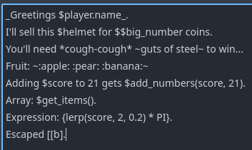
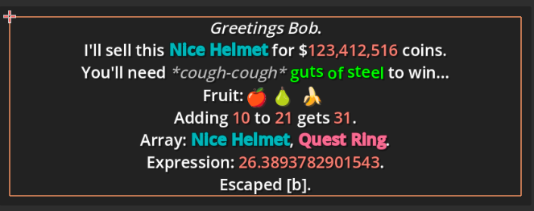
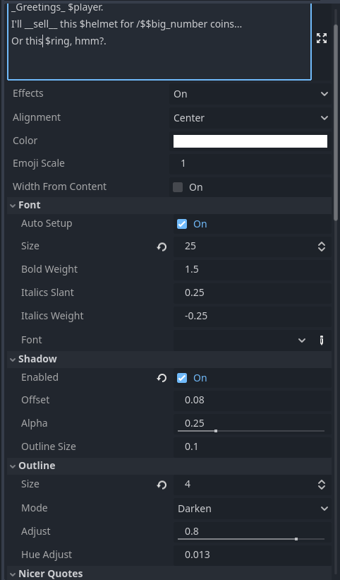

# RichTextLabel2
`v1.15` [Demo](https://github.com/chairfull/GodotRichTextLabel2_Demo)

Two Nodes:
- `RicherTextLabel`: Reduce effort needed to display state data and stylize it.
- `RichTextAnimation`: For dialogue and cinematics, animates text in and out.


| | |
|-|-|
|||

https://github.com/user-attachments/assets/724558ad-f98e-40bb-8f30-dc413705c166

https://github.com/user-attachments/assets/caf703ad-44d3-43b0-b4f9-56f513ac572f

# Features
- Multi bbcode tags + easy closing + auto color names: `[deep_sky_blue;b]Bold blue[] and [orange;i]Italic orange[].`
- Integer tags for absolute font size, float tags are relative font_size: `[32]Big text[] and [0.5]half text.[]`
- Auto emojis: `I'm :smile: with results. You get a :+1:.`
- Effects automatically installed when you use them: `We on the [sin]sinewave[] vibe.`
	- Many premade effects. See Tags section below.
- Context strings: `Only $coins coins, $player.name? Travel to $location.get_name("west") for more coins.`
	- Can call functions or get nested properties.
	- Niceifys integers with commas. `1234 -> 1,234`
	- Niceifys objects by calling `to_rich_string()` if it can.
	- Niceifys arrays by joining them into a comma seperated list.
- Easy font selection dropdown detects all fonts in the project.
	- Automatically creates Bold, Italic, and Bold Italic font variations if they don't exist.
	- Tweakable boldness and italic slant.
- Automatic opening and closing quotes.
- Customize how Markdown gets converted: `_italic_ -> [i]%s[] -> [i]italic[]` `*cough* -> [i]*%s*[] -> [i]*cough*[]`.
- Auto color formatting: `"My [%s]colored string[] is easy." % [Color.DEEP_SKY_BLUE]`
- `RichTextAnimation` for fading in and out.
	- 7 transition effects. (Some unstable/untested.)
	- Click2Continue node that can display at the last visible character.
	- `[hold] [h]` Tag to pause animation until user. `Wait...[h] Did you hear...[h] *Bang*!`
	- `[wait] [w]` Tag to wait in seconds. (Defaults to 1) `Let me thing.[w] Hmm...[w]...[w]...`
	- `[pace] [p]` Set pace of animations. `A slow talker [p=.1]talks like this...[p] While fast talkers [p=3]talk like this...`
- Many more I can't rememember... there are a lot of features.

> [!NOTE]
> You need to create a `FontHelper` somewhere in your project.
> Then press the `Update` button to update it's font list.
> You can then select fonts from the `RicherTextLabel` drop down.




# Tags

|Tag|Description|Example|
|:-:|-----------|:--:|
|`@` `meta`|Executes an expression on the context node when pressed.<br>If it starts with `https://` it will load a browser.|`[@print("Hey!")]`|
|`^` `hint`|Expression that becomes a hint popup.|`[^sword.get_hover_text()]`|
|`!`|Image id. Doesn't require extension.|`My icon: [!icon]`|
|`dim`|Dims color by 33%.||
|`lit`|Lightens color by 33%.|
|`hue`|Shifts hue. 0 or 1 = no change. 0.5 = opposite end of spectrum.|`[hue 0.25]`|
|`beat`|Pulses in size and color.||
|`curspull`|Pulls towards cursor.|`[curspull pull=-1]`|
|`cuss`|Animation to replace vowels with symbols.|`What the [cuss]heck[].`|
|`heart`|Animated love bounce. Demonstrates changing font and using emojis.||
|`jit`|||
|`jit2`|Jittering nervous animation.||
|`jump`|||
|`jump2`|||
|`l33t`|Animation to replace letters with numbers.||
|`off`|Ignore. Offsets.||
|`rain`|Simulates rain. What for? I don't know.||
|`secret`|Hidden unless mouse cursor is nearbye.||
|`sin`|Might not work as sin is now built in?||
|`sparkle`|Animation to sparkle character colors. Meant to be used with color tags.||
|`sway`|Just skews back and forth.||
|`uwu`|Converts all R's and L's to W's.||
|`wack`|Randomly animates rotation and scale for a wacky look.||
|`woo`|Animates between upper and lower case, creating a sarcastic tone.||
|`pulse`|[Built in](https://docs.godotengine.org/en/stable/tutorials/ui/bbcode_in_richtextlabel.html#pulse)||
|`wave`|[Built in](https://docs.godotengine.org/en/stable/tutorials/ui/bbcode_in_richtextlabel.html#wave)||
|`tornado`|[Built in](https://docs.godotengine.org/en/stable/tutorials/ui/bbcode_in_richtextlabel.html#tornado)||
|`shake`|[Built in](https://docs.godotengine.org/en/stable/tutorials/ui/bbcode_in_richtextlabel.html#shake)||
|`fade`|[Built in](https://docs.godotengine.org/en/stable/tutorials/ui/bbcode_in_richtextlabel.html#fade)||
|`rainbow`|[Built in](https://docs.godotengine.org/en/stable/tutorials/ui/bbcode_in_richtextlabel.html#rainbow)||

## Colors
There are multiple color tag patterns.
|Pattern|Description|Example|
|-------|-----------|-------|
|`[red]`|Any name for a builtin color will work as a tag.|`[red]Red text.[]`|
|`[0xff0000]`|Hex Codes will be converted to their color.|`[0xff0000]Red text.[]`|
|`[(1.0, 0.0, 0.0)]`|Bracketed floats. This is meant to be used with string formatting.|`"[%s]Red text.[][%s] Blue text.[]" % [Color.RED, Color(0.0, 0.2, 1.0)]"`|

You can override colors in `ProjectSettings` at `"richer_text_label/colors"`. Keys are tags to replace and values are what to use instead.

# RichTextAnimation

This node is meant for dialogue systems and cinematics.

## Animation Tags

|Tag|Description|Arguments|Example|Self Closing|
|:-:|-----------|---------|:-----:|:----------:|
|`wait` or `w`|Waits a second.|Number of seconds.|`Wait...[w=2] Did you hear...[w] *bang*`|✅|
|`hold` or `h`|Holds until `advance()` is called.|`[h]`||✅|
|`pace` or `p`|Sets animation speed.|Scale.|`[p=2.0]Fast talker.[p=0.2]Slow talker.[p]Normal speed.`|✅|
|`skip`|Skips animation across selected items.||`They call it [skip]The Neverending Forest[].`|❌|
|`$`|Runs an expression at this spot in the animation.|Expression.|`Did you hear something...[$play_sound("gurgle")]`|✅|
|`#`|Calls `on_bookmark.emit()` with the id when reached.|Bookmark id.|`He told me [#quote]the haunted forest[#endquote] wasn't so haunted.[#end]`|✅|

## Animations

|Tag|Description|Arguments|
|:-:|-----------|---------|
|`back`|Characters bounce back in.||
|`console`|(Broken) Simulates a computer console.||
|`fader`|Characters alpha fades in.||
|`fallin`|Characters are scaled down from a large size.||
|`focus`|Characters slide in from all random directions.||
|`fromcursor`|Characters slide in from cursor position.||
|`growin`|Characters scale up from tiny.||
|`offin`|Characters slide in from a slight offset to the left.||
|`prickle`|Character alpha fades in but with a random offset. Requires a low `fade_in_speed` to look right.||
|`redact`|(Broken) Simulates redacted text being exposed.||
|`wfc`| Characters start out as random 0's and 1's and eventually "collapse".||

If `shortcut_expression = true` you can use the `<code expression>` pattern instead of the `[!code expression]` pattern.
```
Did you hear something...[wait][$play_sound("gurgle")] Uh oh![$player.fear = 100.0] Ahh...
Did you hear something...[wait]<play_sound("gurgle")> Uh oh!<player.fear = 100.0> Ahh...
```

If `shortcut_bookmark = true` you can use the `#bookmark` pattern instead of the `[#bookmark]` pattern.
```
He told me#quote the haunted forest#endquote wasn't so haunted.#end
He told me[#quote] the haunted forest[#endquote] wasn't so haunted.[#end]
```

# Fonts
When you enable the plugin, it scans your projects file system for fonts, adding them to `richer_text_label/fonts` which are then accessible in the `font` drop down.

# Emoji Fonts
If a font has "emoji" (any case) in it's name, it will be used for emojis instead of the default font.

Emojis sometimes lag on some computers, which I get around by creating a custom FontVariant that uses the emoji font as a base and `ThemeDB.fallback_font` as a fallback font. This seems to prevent lag spikes.

If an emoji tag is used `:smile:` or `[:smile:]` an `emoji_font` metadata key will be created with the font.

# Pipes
Pipes `|` post process strings.

There are two ways to use them.
- Inside expressions `{$score+2|pipe}`
- Or as a tag `[|pipe]Text to be passed.[]`

```gd
# These are all doing the same thing.
"We'll visit {location|capitalize} tomorrow."
"We'll visit {location.capitalize()} tomorrow."
"We'll visit [|capitalize]$location[] tomorrow."

# Arguments can also be passed as a space seperated list:
# These are all the same.
"Day of week: {time.day_of_week|substr 0 3}"
"Day of week: {time.day_of_week.substr(0, 3)}"
"Day of week: [|substr 0 3]$time.day_of_week[]"
```

The real power is in adding your own. Pipes try to use a method inside the context node.
```gd
func cap(x):
	return x.capitalize()

func oooify(x):
	if cow_mode == CowMode.ACTIVATED:
		return x.replace("o", "[sin]ooo[/sin]").replace("O", "[sin]OOO[/sin]")
	else:
		return x

# Pipes can be chained.
# Location name gets capitalized, and all it's O's stretched out.
"We'll visit {location|cap|ooify}."

# Or we may want to change entire the dialogue based on state data.
[|ooify]Wow those cows were mooing.[]
```

Or maybe you want to stylize content based on the characters mood.
```gd
# If returning BBCode, it has to be old fashioned style.
func mood(s: String, npc_id: String):
	match npcs[npc_id].emotion:
		Emotion.HAPPY: return "[color=yellow]%s[/color]" % s
		Emotion.SAD: return "[color=aqua]%s[/color]" % s
		Emotion.ANGRY: return "[color=red]%s[/color]" % s
		_: return s

"Mary: [i;|mood mary]What I'm saying will be colored based on my mood.[]"
"John: [i;|mood john]What I'm saying will be colored based on my mood.[]"
```

> [!NOTE]
> The BBCode `[|pipe]` tag function must return old fashioned BBCode. 
> It doesn't support the labels features like Markdown replacement.
> Eventually I'll fix that.


# Changes
- 1.15
	- Allows floats beginning with a ".": `Normal [.5]half size[]`
	- Implemented `effect_weight` which can be used for tweening effects on and off.
		- `[sin]` effects scale.
		- `[jit]` `[jit2]` effects jitter amount.
		- `[jump]` `[jump2]` effects jump amount.
		- `[rain]` effects tint and motion.
		- `[sparkle]` effects hue and value adjustment scale.
		- `[sway]` effects sway scale.
		- `[wack]` effects scaling amount.
	- Added `speed` property to `[jump]` and `[jump2]`.
	- Changed `[cuss]` so it only censors vowels.
	- Changed `[sway]` to be more randomized.
	- Changed `[wack]` to only modify scale.
	- `[cuss]` no longer changes font color unless you ask `[cuss=red]`.
	- Image tag can take a path starting with `res://` or `user://`: `[!user://myimage]`
	- Added `ProjectSettings` `richer_text_label/user_effects_dir` for having a custom effect directory.
	- Rewrote some `RichTextEffectBase` so it's easier to work with.
	- `context_state` auto sets keys to `StringName` if Godot >=4.4.
- 1.14
	- If using Godot v4.4+ the ProjectSettings `color` override will be a typed dictionary.
	- Allows using `Color` in the ProjectSettings `color` override.
- 1.13
	- Major change to FontHelper, it now adds a font list to ProjectSettings when you enable the plugin.
	- Moved overriding color tags to ProjectSettings instead of a config file.
- 1.12
	- Added hex color tag pattern: `[0xff0000]red[]`.
	- Added ability to override colors and add own with `res://richtext_tags.cfg`.
	- Updated README.md to explain `res://richtext_tags.cfg`.
	- Fixed bracket color pattern not using alpha channel.
	- Fixed bracket color pattern erroring when only RGB was given.
- 1.11
	- Removed Godot 4.4 feature `export_tool_button` in `FontHelper`.
	- **Breaking:** Godot 4.4 added an `is_finished()` function which conflicted with this asset so changed...
		- `is_finished()` -> `is_anim_finished()`
		- `is_holding()` -> `is_anim_holding()`
		- `is_waiting()` -> `is_anim_waiting()`
		- `finish()` -> `finish_anim()`
- 1.10
	- **Breaking:** Changed meta symbol to `@` instead of `!`.
	- Added `[!image]` tag for adding images.
	- Fixed fonts being reset in exported projects.
	- Made `FontHelper` a resource you need to create.
	- Updated to 4.4 by removing `fit_width` reference.
- 1.9
	- Added hack to improve editor instancing speed by disabling `_get_property_list()` when `show_properties = false`.
	- Cached Regex patterns.
	- Removed `fit_width` and `fit_width_buffer` since `fit_content` works if `autowrap_mode = off`.
- 1.8
	- Fixed support for built in effects: `pulse` `wave` `tornado` `shake` `fade` `rainbow`
	- Removed Godot 4.4.dev feature: `PROPERTY_HINT_DICTIONARY_TYPE`
- 1.7.1
	- Fixed `FontHelper` erroring on built projects.
- 1.7
	- Changed `set_bbcode` to queue for the end of the frame.
	- Moved tag state and stack to `STACK_STATE` object.
	- Moved `font_cache` and font functions to `FontHelper`.
	- Removed `_random` and set as meta property since it's rarely used.
- 1.6.3
	- Fixed `color` property not being settable from script.
	- Fixed alignment error and used slightly more efficient method.
- 1.6.2
	- Removed Godot 4.4.dev feature: `horizontal_alignment` property.
- 1.6.1
	- Removed Godot 4.4.dev feature: Explicitly typed dictionary.
- 1.6
	- Added `outline_color` to set the default outline color.
	- Added outline modes:
		- `CUSTOM` to apply default `outline_color` to all text.
		- `CUSTOM_DARKEN` to apply `outline_color` to non colored text, but darken outlines otherwise.
		- `CUSTOM_LIGHTEN` to apply `outline_color` to non colored text, but lighten outlines otherwise.
	- Renamed `OutlineStyle` to `OutlineMode` to match property `outline_mode`.
	- Fixed `OutlineMode.OFF` not turning off outlines.
- 1.5
	- Added `[!]` meta tag which calls an expression when pressed.
	- Added `[^]` hint tag which calls an expression to display in a popup when hovered.
	- Added custom tooltip for `hint` tags which now use the `RicherTextLabel`.
	- Added `meta_auto_https` which opens urls in a browser.
	- Added `fit_width` which will set `custom_minimum_size.x = get_content_width()`.
	- Handles `\n` better now.
	- Removed `alignment` since original `RichTextLabel` now has `horizontal_alignment`.
- 1.4.2
	- Fixed custom `RichTextEffects` not working on built projects.
- 1.4.1
	- Fixed variables not being resetable to defaults.
- 1.4
	- Changed how bbcode is initialized when not yet inside the tree.
	- Made node selection slightly faster by moving all `@export` to `_get_property_list`.
	- Made node selection slightly faster by caching project fonts.
	- Renamed scripts to lowercase to match Godots prefered style.
	- Renamed `context_nice_*` properties to `context_rich_*`.
- 1.3 **BREAKING CHANGES**
	- Change: Class name `RicherTextLabel` from `RichTextLabel2` to prevent future problems.
	- Change: Objects can implement `to_rich_string()` instead of `to_string_nice()`.
	- `advance()` only skips to next `[wait]` `[hold]` or `[$expression] instead of all triggers.
	- `advance()` returns true if still playing.
	- Added tiny wait timer when forcing a finish, so the user doesn't accidentally skip text.
	- Fixed scene sizes being massive by preventing auto fonts saving to disk.
	- Fixed `fit_content` not working. Now `override_fitContent` really forces `custom_minimum_size`.
	- Fixed cursor based effects being very laggy.
	- Fixed ctc_position handling on new lines.
	- Fixed animations jumping when nearly finished.
	- Fixed `set_bbcode` being called many times in a row.
- 1.2
	- Added pipes `|`. See README.
	- Added auto styling of decimal numbers:
		- `autostyle_numbers_pad_decimals` Enable?
		- `autostyle_numbers_decimals` Number of decimals.
	- Added 4 new effects:
		- `[curspull]` shows how to animate based on cursor position.
		- `[wack]` randomly scales and rotates characters.
		- `[beat]` pulses it's scale and color every second.
		- `[secret]` hides characters unless cursor is nearbye.
	- Animation
		- Added 3 new animations:
			- `[fromcursor]` which transitions letters to and from cursor position.
			- `[growin]` scales characters in, overshooting, then scaling to proper size.
			- `[offin]` moves characters in from an left offset.
	- Tweaked `[cuss]` `[heart]` `[rain]` `[sway]` `[uwu]`.
	- Fixed regression in effects based on text characters.
	- Fixed Markdown symbols catching when inside `[] {} or <>`.
- 1.1
	- Added `context_state: Dictionary` for passing additional arguments available in expressions.
	- Added `{}` pattern for including complex expressions. Example: `{lerp(score, 2, 0.2) * PI}`.
	- Added `autostyle_emojis` to disable emoji detection.
	- Changed bracket escapes to be `[[]` pattern instead of `\[]` pattern.
	- Fixed `emoji_font` not loading.
	- Fixed `emoji_scale` not affecting emojis.
	- Fixed effects not animating after an emoji was used.
	- Fixed custom_effects each having text metadata.
	- Fixed Markdown detection not working when around tags.
	- Added many more comments.
	- Animation
		- Added `ctc_offset`.
		- Added `ctc_on_wait` to control whether ctc is visible while waiting for timer.
		- Added `ctc_on_finish` to control whether ctc is visible when animation finishes.
		- Added `default_wait_time` for the `[wait]` and `[w]` tags.
		- Added signals for when waiting starts and stops.
		- Added signals for when hold starts and stops.
		- Added `signal_quotes` and signals for when a "quote" starts and stops.
		- Added `signal_stars` and signals for when *stars* start and stop. 
		- Fixed expression triggers.
		- Fixed bookmark triggers.
		- Fixed tags `[wait][w][hold][h][pace][p][skip]`.
		- Fixed ctc showing up properly.
		- Renamed signals so their function is more obvious.
